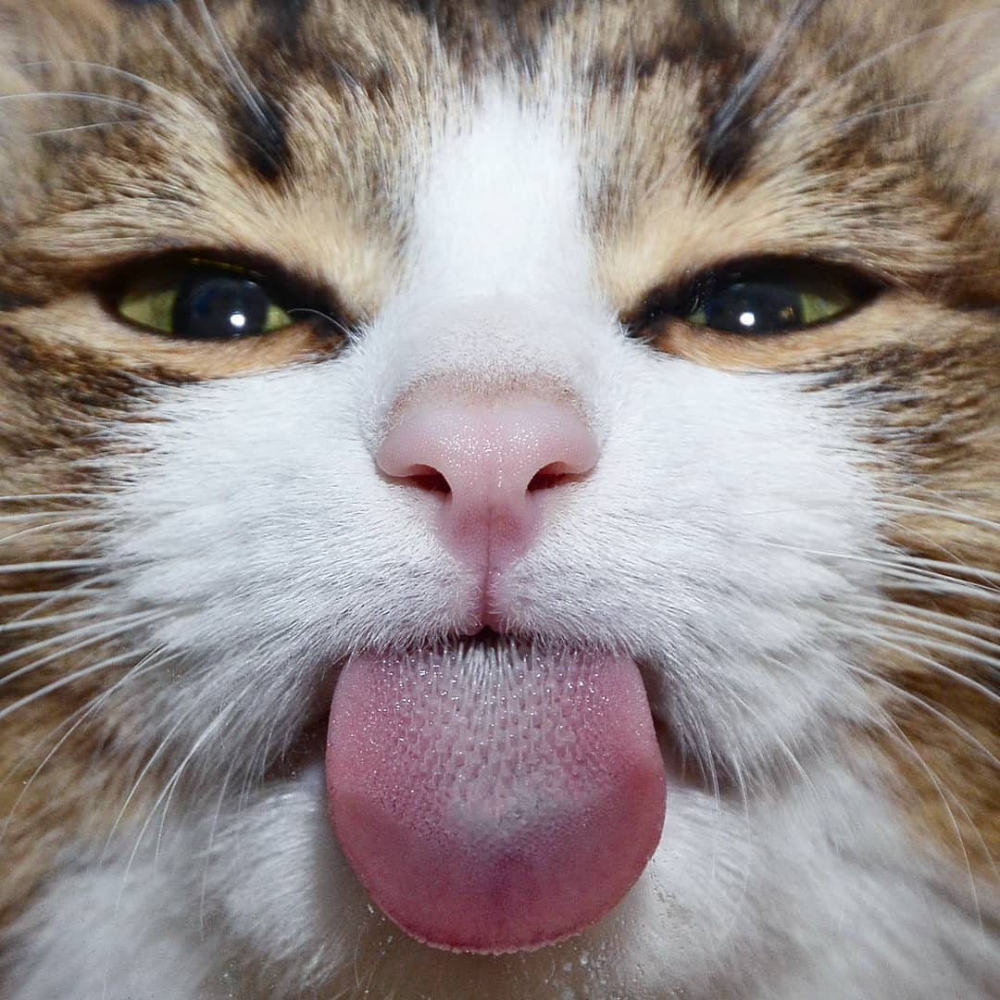

  

# ChaT

## Setup

1. Install [Node.js](https://nodejs.org/en/download/) (v18.0.0 or higher)
2. Clone this repository
3. Copy `.env.example` to `.env` and fill in the values
4. Run `npm install` to install dependencies
5. Run `npm run start` to start the development server

## Features

- [x] Authentication
- [x] Real-time chat
- [x] Offline support
- [x] Create, edit and delete messages
- [x] Delete entire conversations
- [x] Search for users by email

## Technologies

- [React](https://reactjs.org/)
- [React Native](https://reactnative.dev/)
- [TypeScript](https://www.typescriptlang.org/)
- [Expo](https://expo.dev/)
- [Supabase](https://supabase.io/)
- [React Navigation](https://reactnavigation.org/)
- others...
